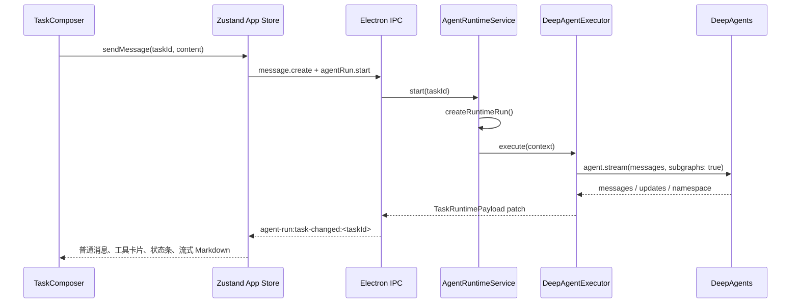

# Agent 流式输出到前端的完整链路

本文说明 AnyBuddy 中一次用户提问、主 Agent / 专家团执行、工具调用、子 Agent 输出，以及最终 Markdown 如何到达任务详情页。

本文描述的是当前实现的正常完成路径。应用级会话由 `Task` 表示，一次提交对应一个主 `AgentRun`；专家团成员是 DeepAgents 的内部子图，不会各自创建独立的应用级 `AgentRun`。

## 总体流程



## 1. 用户提交与任务配置

`src/renderer/components/TaskComposer.tsx` 的 `handleSubmit()` 收集用户输入、模式、模型、工具、专家和专家团配置，并调用页面传入的 `onSend()`。

`src/renderer/pages/task-detail/TaskDetailComposerSection.tsx` 的 `onSend` 实现会先通过 `clients.task.update()` 保存当前任务的配置（其中包含 `activeExpertTeamId`），再调用 `sendMessage(taskId, content)`。

`src/renderer/stores/app-store.ts` 的 `sendMessage()` 依次执行：

1. `clients.message.create(taskId, { content, role: 'user' })`：持久化用户消息。
2. `clients.agentRun.start(taskId, { agentName: 'Main Agent', kind: 'main' })`：创建并启动主运行。

相关位置：

- `src/renderer/components/TaskComposer.tsx:381`
- `src/renderer/pages/task-detail/TaskDetailComposerSection.tsx:38`
- `src/renderer/stores/app-store.ts:805`

## 2. AgentRun 创建与执行入口

`src/main/services/agent-runtime-service.ts` 的 `start()` 是应用级运行入口：

1. 读取 Task 和设置。
2. 调用 `AppService.createRuntimeRun()` 创建 `AgentRun`。
3. 后台异步调用 `executeRuntime()`；IPC 调用不会等待模型生成完成。

`AppService.createRuntimeRun()` 生成 `run.id`、`agentId`、`graphThreadId`，写入 `run_started` 事件，并广播该任务的 runtime snapshot。

`AgentRun` 的 `kind` 在这里是 `main`。专家团成员没有通过这个入口创建 `kind: 'subagent'` 的记录；它们是 DeepAgents 运行内部的子图。

相关位置：

- `src/main/services/agent-runtime-service.ts:55`
- `src/main/services/agent-runtime-service.ts:174`
- `src/main/services/app-service.ts:1128`
- `src/shared/types.ts:108`

## 3. DeepAgents 与专家团初始化

`AgentRuntimeService.executeRuntime()` 会：

1. 将主 Run 切换为 `running`。
2. 构建任务提示词和可用工具。
3. 根据 `task.activeExpertId` 与 `task.activeExpertTeamId` 解析当前专家或专家团。
4. 构建 `assistantMetadata`，其中包括 `expertName` 或 `expertTeamName`。
5. 调用 `DeepAgentExecutor.execute()`。

在 `DeepAgentExecutor.execute()` 中，`activeExpertTeam.members` 被转换成 DeepAgents 的 `subagents` 配置。专家团 Leader 的 system prompt 要求用 `task` 工具委派成员工作，然后汇总最终结论。

随后调用：

```ts
agent.stream(
  { messages: taskContext.messages },
  {
    streamMode: ['messages', 'updates'],
    subgraphs: true,
  },
)
```

`subgraphs: true` 是接收专家团子 Agent 事件的关键。流中的每个项目形如：

```ts
[namespace, mode, data]
```

- `namespace`：输出来源；主 Agent 是 `main`，子 Agent 通常带 `tools:<toolCallId>`。
- `mode: 'messages'`：文本 chunk、工具调用、工具结果。
- `mode: 'updates'`：图节点状态变化。

相关位置：

- `src/main/services/agent-runtime-service.ts:174`
- `src/main/services/agent-runtime-service.ts:302`
- `src/main/services/deepagent-executor.ts:560`
- `src/main/services/deepagent-executor.ts:601`
- `src/main/services/deepagent-executor.ts:615`

## 4. 子 Agent 名称如何关联

DeepAgents 子图 namespace 中只有 `tools:<toolCallId>`，没有直接携带专家名称。执行器通过以下步骤恢复名称：

1. `readToolCallChunks()` 读取模型流式返回的 `tool_call_chunks`，保留 `index`，避免多个并行工具调用互相覆盖。
2. 工具参数累积为完整 JSON 后，若工具为 `task`，提取 `subagent_type` 与 `description`。
3. 将 `toolCallId -> { subagentType, description }` 记入 `toolCallSubagentMap`。
4. `readNamespaceSource()` 再把 `tools:<toolCallId>` 转换为 `subagentType`。
5. `resolveSubagentDisplayName()` 用专家团成员配置得到例如 `架构专家 (架构师)` 的展示名。

相关位置：

- `src/main/services/deepagent-executor.ts:370`
- `src/main/services/deepagent-executor.ts:414`
- `src/main/services/deepagent-executor.ts:674`
- `src/main/services/deepagent-executor.ts:716`

## 5. 工具调用的事件路径

模型产生完整工具调用后，执行器发送：

```ts
appendRuntimeEvent(runId, 'tool_called', {
  toolName,
  arguments,
  toolCallId,
  namespace,
  subagentName,
  runtimeScope,
})
```

工具返回时，发送 `tool_result`，其中包含工具名称、结果、摘要、来源 namespace 和子 Agent 名称。

`AppService.appendRuntimeEvent()` 使用 `mutate()`，所以普通运行事件会立即写入 SQLite，然后通过 runtime patch 广播给前端。

相关位置：

- `src/main/services/deepagent-executor.ts:750`
- `src/main/services/deepagent-executor.ts:773`
- `src/main/services/app-service.ts:1178`

## 6. 子 Agent 生命周期的事件路径

当收到第一个已识别的子 Agent 事件时，执行器发送：

```text
subagent_started
```

在 `updates` 模式下，子 Agent 的节点状态被转换为：

```text
subagent_progress
```

外层 `agent.stream()` 完整结束后，执行器为所有已启动子 Agent 统一发送：

```text
subagent_completed
```

注意：`subagent_completed` 当前是在整个外层流结束后统一发送，不是子 Agent 内部刚完成时立即发送。

相关位置：

- `src/main/services/deepagent-executor.ts:685`
- `src/main/services/deepagent-executor.ts:830`
- `src/main/services/deepagent-executor.ts:855`

## 7. 流式 Markdown 的事件路径

普通文本 token 走独立路径：

1. `readChunkText()` 提取文本。
2. 按 `msgId` 累积内容，避免每个 token 形成独立消息。
3. 记录 `namespace` 与 `subagentName`。
4. 调用 `upsertAgentMessageEvent(runId, 'msg-' + msgId, nextText, metadata)`。

流式事件使用 `mutateTransient()`，不会为每个 token 持久化。`queueStreamEventPatch()` 以 50ms 防抖批量推送 runtime patch，避免 IPC 与 React 频繁刷新。

相关位置：

- `src/main/services/deepagent-executor.ts:789`
- `src/main/services/deepagent-executor.ts:809`
- `src/main/services/app-service.ts:388`
- `src/main/services/app-service.ts:1442`

## 8. 主进程到渲染进程的 IPC 路径

`AppService.emitTaskRuntimePatch()` 将变更交给 `AppEventBus`。

应用启动时，`src/main/index.ts` 包装 `bus.emitTaskRuntime()`，把 payload 发送到：

```text
agent-run:task-changed:<taskId>
```

Preload 层通过 `ipcRenderer.on()` 监听这个频道，并以 `window.anybuddy.agentRun.subscribeTask()` 暴露给渲染进程。

相关位置：

- `src/main/services/app-service.ts:373`
- `src/main/index.ts:37`
- `src/preload/bridge.ts:95`
- `src/shared/types.ts:168`

## 9. Zustand 如何区分流式文本和普通事件

选中任务时，`app-store.selectTask()` 先拉取历史 messages、runs、events、approvals，再注册 `subscribeTask()`。收到 patch 后，先按 `requestAnimationFrame` 合批。

### 流式 `agent_message`

流式事件不会进入普通 `messages` 或 `taskEvents`，而是写入：

```ts
streamingContentByMessageId
streamingMessageIdsByRun
```

这样每个 token 只更新独立的流式区域，不会重建整条历史消息列表。

### 工具、子 Agent 与失败事件

非流式事件会进入 `taskEvents`。`buildVisibleMessages()` 通过 `summarizeRuntimeEvent()` 把它们转换成 synthetic `Message`，混入左侧对话流。

相关位置：

- `src/renderer/stores/app-store.ts:557`
- `src/renderer/stores/app-store.ts:686`
- `src/renderer/stores/app-store.ts:244`
- `src/renderer/stores/app-store.ts:316`
- `src/renderer/stores/runtime-message-view.ts:87`
- `src/renderer/stores/runtime-message-view.ts:160`

## 10. 事件到界面的映射

| 运行数据 | Store 中的形态 | 左侧聊天区表现 |
| --- | --- | --- |
| `agent_message` 且 `streaming: true` | 独立流式字典 | 实时 Markdown 气泡 |
| 最终或中间 `Message` | 持久化 message | 普通 assistant Markdown 气泡 |
| `tool_called` | synthetic `role: 'tool'` | 可折叠“调用工具”卡片 |
| `tool_result` | synthetic `role: 'tool'` | 可折叠“工具结果”卡片 |
| `subagent_started` | synthetic `role: 'system'` | 居中蓝色状态条 |
| `subagent_progress` | synthetic `role: 'system'` | 居中进度状态条 |
| `subagent_completed` | synthetic `role: 'system'` | 居中绿色完成状态条 |
| `run_failed` | synthetic `role: 'system'` | 错误卡片 |

`TaskDetailMessageList` 的渲染责任如下：

- `renderMarkdown()`：`ReactMarkdown + remarkGfm`。
- `CollapsibleToolMessage()`：工具调用/结果、参数和返回值。
- `MessageItem()`：普通消息和子 Agent 状态条。
- `StreamingMessageList()`：独立渲染暂态流式 Markdown，并负责自动滚动。

相关位置：

- `src/renderer/pages/task-detail/TaskDetailMessageList.tsx:11`
- `src/renderer/pages/task-detail/TaskDetailMessageList.tsx:86`
- `src/renderer/pages/task-detail/TaskDetailMessageList.tsx:242`
- `src/renderer/pages/task-detail/TaskDetailMessageList.tsx:392`
- `src/renderer/pages/task-detail/TaskDetailMessageList.tsx:461`

## 11. 运行结束、持久化与流式替换

DeepAgentExecutor 在流结束后：

1. 选择主 Agent 最终输出；没有主输出时回退到最后一个 assistant 输出。
2. 将除最终段外的内容构造成 `intermediateMessages`，其中包含子 Agent 输出及其 `subagentName`。
3. 调用 `completeRuntimeRun()` 或 `completeRuntimeRunWithPlanApproval()`。

`completeRuntimeRun()` 在同一次 `mutate()` 中更新 Run 状态、写入中间消息和最终消息，然后发送消息 patch。

前端收到持久化 message 后，按 `metadata.streamEventId` 删除对应的临时流式段；最终消息只会在所有流段都有持久化替代物后清理整次 Run 的暂态内容。

相关位置：

- `src/main/services/deepagent-executor.ts:867`
- `src/main/services/app-service.ts:1230`
- `src/renderer/stores/app-store.ts:362`

## 12. 当前实现的展示限制

### 实时子 Agent Markdown 未保留来源名称

`StreamingMessageList` 目前只从 Store 读取 `{ id, runId, content }`，重新构造的流式 assistant Message 只带当前 `expertName` 或 `expertTeamName`，没有从原始流事件带入 `subagentName`。

因此专家团运行中，架构、前端、后端专家的实时 Markdown 都可能统一显示为专家团名称。运行结束并写入中间 Message 后，持久化消息才带有 `subagentName`，可以显示 `[子 Agent: 架构专家]` 之类的标题。

相关位置：

- `src/renderer/pages/task-detail/TaskDetailMessageList.tsx:405`
- `src/renderer/pages/task-detail/TaskDetailMessageList.tsx:435`

### 右侧 Runtime Sidebar 没有事件时间线

`TaskDetailRuntimeSidebar` 当前显示主 Run、当前专家或专家团、审批状态、失败原因和事件总数，但没有渲染工具调用或子 Agent 时间线。

`buildRuntimeEventCard()` 与 `buildRuntimeToolCards()` 已能构造结构化卡片数据，但当前没有 React 组件调用它们。因此，工具调用和子 Agent 状态实际展示在左侧聊天流中。

相关位置：

- `src/renderer/pages/task-detail/TaskDetailRuntimeSidebar.tsx:28`
- `src/renderer/stores/runtime-message-view.ts:316`
- `src/renderer/stores/runtime-message-view.ts:464`

## 13. 排查专家团成员未显示或未输出

针对同一个 `runId` 查看 `AgentEvent`：

1. 没有 `tool_called`，或其 `arguments.subagent_type` 中没有目标专家名称：Leader 没有分派该专家。
2. 有 `tool_called`，但没有对应 `subagent_started`：`toolCallId -> subagent_type` 或 namespace 映射未成功。
3. 有 `subagent_started`，但没有该专家来源的 `agent_message`：子 Agent 没有产生有效文本，或模型流未返回子图文本。
4. 有流式文本但运行尚未完成：刷新或进程异常退出前，正文可能尚未成为持久化 Message。
