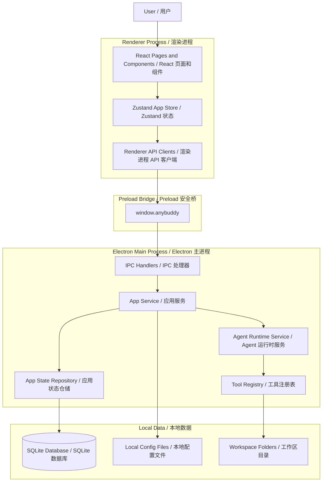

# 技术架构 / AnyBuddy Technical Architecture

AnyBuddy 是一个 Electron 桌面应用，渲染层使用 React，整体使用 TypeScript。应用围绕本地任务式 Agent 工作流组织：用户可以创建任务、附加工作区上下文、选择模型和技能，并在界面中查看运行时输出。

AnyBuddy is an Electron desktop application with a React renderer and TypeScript across the stack. The app is organized around local task-based Agent workflows: users create tasks, attach workspace context, choose models and skills, and inspect runtime output in the UI.

## 架构图 / Architecture Diagram

## 进程边界 / Process Boundaries

### 主进程 / Main Process

`src/main/` 负责 Electron 启动、窗口创建、IPC 注册、持久化、运行时服务，以及需要访问文件系统的行为。这里可以使用 Node.js 和 Electron 主进程 API。

`src/main/` owns Electron bootstrapping, window creation, IPC registration, persistence, runtime services, and filesystem-facing behavior. Code here can use Node.js and Electron main-process APIs.

关键目录 / Key areas:

- `src/main/ipc/`: IPC handler registration / IPC 处理器注册。
- `src/main/repositories/`: SQLite-backed persistence / 基于 SQLite 的持久化。
- `src/main/services/`: application services, model calls, runtime execution, and tool orchestration / 应用服务、模型调用、运行时执行和工具编排。
- `src/main/state/`: initial/default state and local app state helpers / 初始状态、默认状态和本地状态辅助逻辑。

### Preload

`src/preload/` 向隔离的渲染进程暴露一个窄接口。渲染进程代码应通过该桥调用主进程能力，而不是直接导入 Electron 或 Node API。

`src/preload/` exposes a narrow bridge from the isolated renderer process to the main process. Renderer code should use this bridge rather than importing Electron or Node APIs directly.

### 渲染进程 / Renderer

`src/renderer/` 包含 React 应用，负责页面、组件、本地 UI 状态，以及围绕 preload 桥封装的客户端调用。

`src/renderer/` contains the React application. It owns screens, components, local UI state, and client wrappers around the preload bridge.

关键目录 / Key areas:

- `src/renderer/pages/`: top-level route views / 顶层路由页面。
- `src/renderer/components/`: reusable UI components / 可复用 UI 组件。
- `src/renderer/stores/`: Zustand stores and derived runtime UI state / Zustand 状态和运行时 UI 派生状态。
- `src/renderer/api/`: typed renderer-side API clients / 渲染进程侧类型化 API 客户端。

### 共享契约 / Shared Contracts

`src/shared/` 包含主进程、preload 和渲染进程共享的类型与 IPC 契约。当 IPC payload 发生变化时，应优先更新 shared 类型，确保调用双方保持一致。

`src/shared/` contains types and IPC contracts shared by the main, preload, and renderer layers. When an IPC payload changes, update shared types first so both sides remain aligned.

## 数据流 / Data Flow

1. 用户在 React 页面或组件中操作。
2. 渲染进程状态调用 `src/renderer/api/` 中的类型化客户端。
3. 客户端调用 preload 暴露的 `window.anybuddy`。
4. preload 桥触发 IPC channel。
5. 主进程 IPC handler 将请求委托给应用服务。
6. 服务读写 SQLite、本地配置、工作区文件或运行时状态。
7. 结果通过 IPC 返回渲染进程 store 并更新 UI。

1. The user interacts with a React page or component.
2. Renderer state calls a typed client in `src/renderer/api/`.
3. The client calls `window.anybuddy`, exposed by the preload bridge.
4. The preload bridge invokes an IPC channel.
5. The main-process IPC handler delegates to application services.
6. Services read or write SQLite, local config, workspace files, or runtime state.
7. Results return through IPC to the renderer store and UI.

## 运行时流程 / Runtime Flow

任务执行由主进程运行时服务协调。渲染进程负责展示任务状态、消息、运行时事件、审批和活跃运行，但不应直接执行文件系统操作或模型供应商调用。

Task execution is coordinated by main-process runtime services. The renderer displays task status, messages, runtime events, approvals, and active runs, but it should not directly perform filesystem or model-provider work.

高层流程 / At a high level:

1. 用户从渲染进程创建或继续一个任务。
2. 主进程保存任务元数据、选择的模型、技能、连接器和权限。
3. 运行时服务启动或恢复一个 Agent run。
4. 运行时事件被持久化，并流式返回给渲染进程。
5. UI 基于持久化事件渲染助手输出、工具调用、审批和子 Agent 状态。

1. A task is created or continued from the renderer.
2. The main process stores task metadata, selected model, skills, connectors, and permissions.
3. The runtime service starts or resumes an Agent run.
4. Runtime events are persisted and streamed back to the renderer.
5. The UI renders assistant output, tool calls, approvals, and sub-agent status from persisted events.

## 持久化 / Persistence

应用使用本地 SQLite 持久化核心状态，例如任务、工作区、消息、运行记录、事件和审批。部分配置仍基于本地文件，且应继续通过主进程服务 API 访问。

The app uses local SQLite persistence for core application state such as tasks, workspaces, messages, runs, events, and approvals. Some configuration is still file-based and should remain behind main-process service APIs.

## 扩展点 / Extension Points

- 在 `src/renderer/pages/` 或 `src/renderer/components/` 中添加用户界面。
- 新增跨进程 API 时，需要同时更新 shared IPC 契约、preload 桥方法、主进程 IPC handler 和渲染进程客户端。
- 需要持久化的领域行为应通过主进程服务和仓储实现。
- 运行时能力应通过 Agent runtime service 和 tool registry 扩展。

- Add user-facing UI in `src/renderer/pages/` or `src/renderer/components/`.
- Add cross-process API support by updating shared IPC contracts, preload bridge methods, main IPC handlers, and renderer clients together.
- Add persistent domain behavior through main-process services and repositories.
- Add runtime capabilities through the Agent runtime service and tool registry.

## 设计原则 / Design Principles

- 不要在渲染进程中直接使用 Node.js、文件系统或 Electron 主进程 API。
- IPC 契约应显式且类型化。
- 渲染进程组件应聚焦 UI 状态和用户交互。
- 持久化和运行时编排应保留在主进程。
- 优先提交小而可审查的改动，并保持这些边界清晰。

- Keep Node.js, filesystem, and Electron main APIs out of the renderer.
- Keep IPC contracts explicit and typed.
- Keep renderer components focused on UI state and user interaction.
- Keep persistence and runtime orchestration in the main process.
- Prefer small, reviewable changes that preserve these boundaries.
